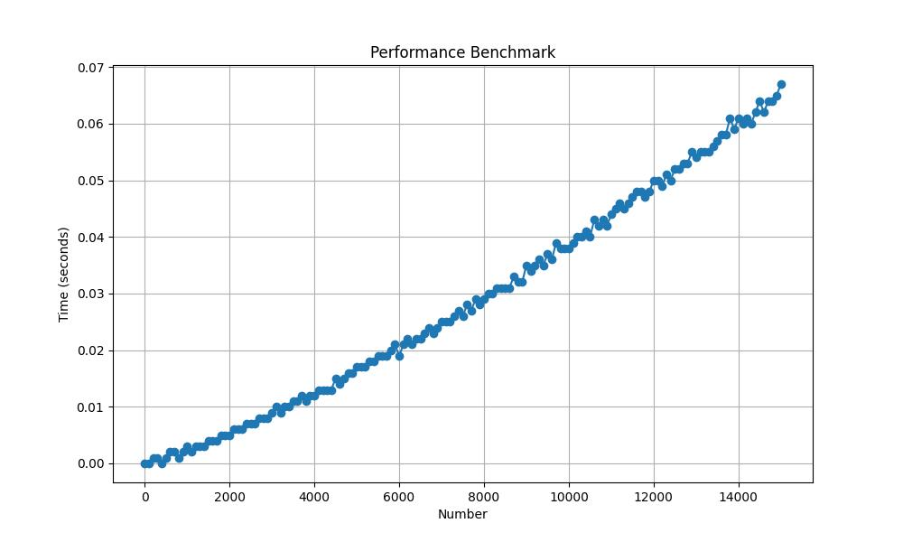

# Perfect and Amicable Numbers Finder

This Python script finds perfect and amicable numbers up to a specified limit.

## How It Works

- `Perfect Numbers`: A number is perfect if the sum of its proper divisors (excluding itself) equals the number.
- `Amicable Numbers`: Two distinct numbers \(a\) and \(b\) are considered amicable if the sum of the proper divisors of \(a\) equals \(b\) and vice versa.

## Usage

### Requirements

- Python 3.x

### Running the Script

Save the script to a file (e.g., `main.py`) and execute it.

#### Default Limit (1500):

```sh
python3 main.py 2000
```

```sh
I am a Perfect number: 6, 6
I am a Perfect number: 28, 28
I am a friendship number: 220, 284
I am a Perfect number: 496, 496
I am a friendship number: 1184, 1210
```

# Graph Plotting

To plot a graph showing the time taken for different input limits, run the benchmark.py script. The plot will be saved as `plots/FROM-MAX-STEP.jpg`, where:

- `FROM` is the starting number.
- `max_n` is the maximum number analyzed.
- `step` is the step used in the analysis.


```sh
python3 benchmark.py 1000 2000 100
```
This will analyze numbers from 1000 to 2000 with a step of 100 and generate a corresponding plot.


Make sure to adjust the placeholders `FROM`, `max_n`, and `step` accordingly when explaining the command for plotting the graph. This README now includes information about the book that inspired the code, usage examples, and instructions for plotting graphs based on benchmark results.


<p>

</p>


# Inspiration
The program code was developed based on the book "The Housekeeper and the Professor" by Yoko Ogawa, which served as an inspiration for exploring numerical properties discussed in the book.


Original Japanese Publication: The book was first published under the title "博士の愛した数式" ("Hakase no Aishita Sūgata") in 2003 in Japan. Written by: Yoko Ogawa and published by Shinchosha Publishing Co., Ltd.

English Publication: The English translation titled "The Housekeeper and the Professor" released in 2009. (English Edition): Stephen Snyder